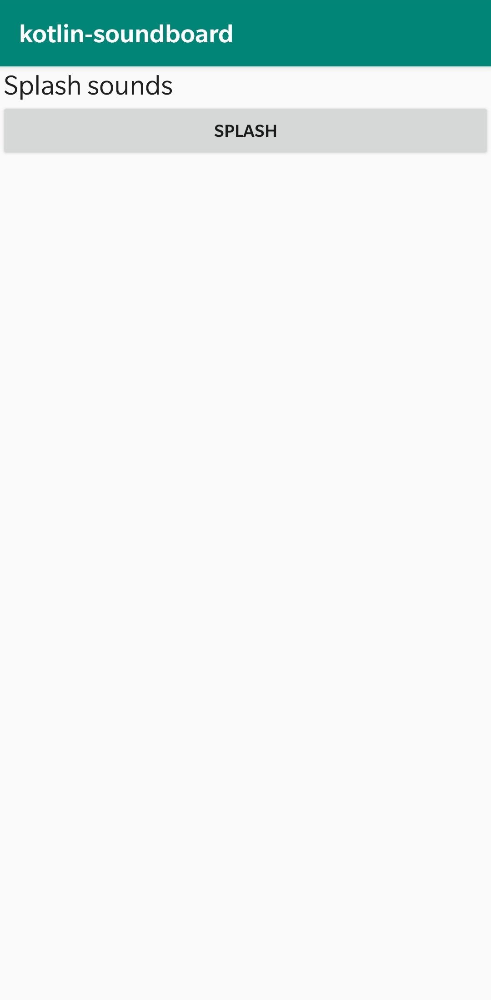

# Kotlin Soundboard

A very basic soundboard for Android, written in Kotlin. 



Adding sounds
----
Add a sound to the view by doing the following:
1) Place a sound file (such as `example.wav`) in the [raw directory](https://github.com/evroon/kotlin-soundboard/tree/master/app/src/main/res/raw).
2) Add a string to [strings.xml](https://github.com/evroon/kotlin-soundboard/blob/master/app/src/main/res/values/strings.xml), which represents the displayed text in the button. Like this:
```xml
<resources>
    <string name="app_name">kotlin-soundboard</string>
    <string name="splash_sounds">Splash sounds</string>
    <string name="splash">splash</string>
    <string name="example">example sound</string>
</resources>
```
3) Register the button in [MainActivity.kt](https://github.com/evroon/kotlin-soundboard/blob/master/app/src/main/java/com/evroon/kotlin_soundboard/MainActivity.kt), by adding it to `layout`:
```kotlin
val layout = arrayOf(
    "textview_splash_sounds",
    "button_splash",
    "button_example"
)
```
It is also possible to add textviews to the layout to split the sounds in categories.
